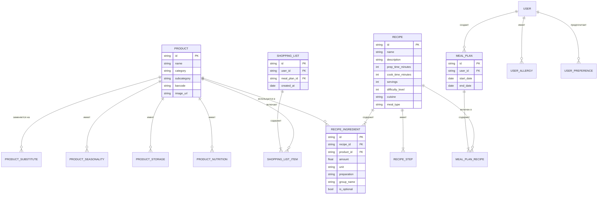

# Анализ проекта Food Manager

## Содержание
1. [Технологический стек](#технологический-стек)
2. [Похожие проекты](#похожие-проекты)
3. [Источники данных](#источники-данных)
4. [Модель данных продуктов](#модель-данных-продуктов)
5. [Модель данных рецептов](#модель-данных-рецептов)
6. [Схема базы данных](#схема-базы-данных)
7. [Best Practices](#best-practices)

---

## Технологический стек

### Рекомендуемый стек

| Слой | Технология | Обоснование |
|------|------------|-------------|
| **Frontend** | Next.js 15 + React 19 | SSR/SSG, API Routes, App Router, отличная экосистема |
| **Стили** | Tailwind CSS v4 | Utility-first, быстрая разработка, маленький bundle |
| **UI Kit** | Shadcn/ui | Кастомизируемые компоненты, Radix primitives |
| **ORM** | Prisma | Type-safe queries, миграции, отличная поддержка SQLite |
| **База данных** | SQLite | Локальная, zero-config, легко мигрировать на PostgreSQL |
| **Валидация** | Zod | Runtime validation, TypeScript integration |

### Альтернативы

- **Drizzle ORM** — легче Prisma, ближе к SQL
- **better-sqlite3** — для прямого доступа без ORM
- **PostgreSQL** — для production с несколькими пользователями

---

## Похожие проекты

### Open Source решения

| Проект | Stars | Стек | Ключевые фичи |
|--------|-------|------|---------------|
| [Mealie](https://github.com/mealie-recipes/mealie) | 7.9k+ | Vue + REST API | Импорт по URL, списки по разделам магазина |
| [Tandoor](https://tandoor.dev/) | — | Django | Планирование на неделю, экспорт в календарь |
| [KitchenOwl](https://github.com/TomBursch/kitchenowl) | — | Flask + Flutter | Real-time sync, offline support |
| [RecipeSage](https://github.com/julianpoy/RecipeSage) | — | PWA | Коллаборация, drag-n-drop планирование |

### Что заимствовать

- **Mealie**: Автоматический импорт рецептов по URL (парсинг schema.org/Recipe)
- **Tandoor**: Экспорт плана питания в календарь (iCal)
- **KitchenOwl**: Offline-first подход, синхронизация
- **RecipeSage**: Автоматическая категоризация списка покупок по разделам магазина

---

## Источники данных

### Пищевая ценность

| Источник | Покрытие | Лицензия | API |
|----------|----------|----------|-----|
| [Open Food Facts](https://world.openfoodfacts.org/) | 2.8M+ продуктов, 150+ стран | Open Database License | REST API |
| [USDA FoodData Central](https://fdc.nal.usda.gov/) | US-focused, research-grade | Public Domain (CC0) | REST API |
| [Edamam](https://developer.edamam.com/) | 28 нутриентов, 90+ лейблов | Коммерческий | REST API |

**Рекомендация**: Начать с **Open Food Facts** (бесплатный, открытый) + **USDA FoodData Central** для точных данных по базовым продуктам.

### Сроки хранения

| Источник | Описание |
|----------|----------|
| [USDA FoodKeeper](https://catalog.data.gov/dataset/fsis-foodkeeper-data) | Официальный датасет по срокам хранения (CC0) |

### Сочетаемость продуктов (Food Pairing)

| Источник | Данные |
|----------|--------|
| [FlavorDB](https://academic.oup.com/nar/article/46/D1/D1210/4559748) | 25,595 молекул вкуса, 936 ингредиентов |
| [FlavorGraph](https://www.nature.com/articles/s41598-020-79422-8) | Граф на основе миллионов рецептов |
| [Foodpairing.com](https://www.foodpairing.com/) | 1700+ ингредиентов (коммерческий) |

### Сезонность

| Источник | Описание |
|----------|----------|
| [Seasonal Food Guide](https://www.seasonalfoodguide.org/) | Интерактивный гайд по регионам |
| [USDA SNAP-Ed](https://snaped.fns.usda.gov/resources/nutrition-education-materials/seasonal-produce-guide) | Официальный сезонный гайд |
| [US Foods Freshness Guide](https://www.usfoods.com/content/dam/usf/pdf/produce/Freshness-Guide.pdf) | Год-круглая доступность |

### Замены ингредиентов

| Источник | Описание |
|----------|----------|
| [FoodSubs](https://foodsubs.com/) | Энциклопедия замен ингредиентов |
| [FoodKG](https://foodkg.github.io/subs.html) | Knowledge Graph для замен |

---

## Модель данных продуктов

### Базовая информация

```typescript
interface Product {
  id: string;
  name: string;
  description?: string;

  // Классификация
  category: ProductCategory;      // овощи, фрукты, мясо, молочные...
  subcategory?: string;

  // Идентификаторы для интеграций
  barcode?: string;               // EAN-13 для Open Food Facts
  usda_fdc_id?: string;           // USDA FoodData Central ID
  open_food_facts_id?: string;

  image_url?: string;
}
```

### Пищевая ценность (на 100г)

```typescript
interface NutritionFacts {
  // Макронутриенты
  calories: number;               // ккал
  protein: number;                // г
  fat: number;                    // г
  fat_saturated?: number;         // г
  fat_trans?: number;             // г
  carbohydrates: number;          // г
  sugar?: number;                 // г

  // Клетчатка (важно для здоровья ЖКТ)
  fiber_total?: number;           // г
  fiber_soluble?: number;         // г - снижает холестерин
  fiber_insoluble?: number;       // г - улучшает пищеварение

  // Соль и вода
  sodium?: number;                // мг
  water?: number;                 // г

  // Гликемические показатели
  glycemic_index?: number;        // 0-100 (низкий <55, средний 55-70, высокий >70)
  glycemic_load?: number;         // GI × порция / 100
}
```

### Микронутриенты (% от DRI на 100г)

```typescript
interface Micronutrients {
  // Витамины
  vitamin_a?: number;             // % DRI (Retinol Activity Equivalents)
  vitamin_c?: number;             // %
  vitamin_d?: number;             // %
  vitamin_e?: number;             // %
  vitamin_k?: number;             // %
  vitamin_b1?: number;            // % (Thiamin)
  vitamin_b2?: number;            // % (Riboflavin)
  vitamin_b3?: number;            // % (Niacin)
  vitamin_b5?: number;            // % (Pantothenic Acid)
  vitamin_b6?: number;            // %
  vitamin_b7?: number;            // % (Biotin)
  vitamin_b9?: number;            // % (Folate)
  vitamin_b12?: number;           // %

  // Минералы
  calcium?: number;               // %
  iron?: number;                  // %
  magnesium?: number;             // %
  phosphorus?: number;            // %
  potassium?: number;             // %
  zinc?: number;                  // %
  copper?: number;                // %
  manganese?: number;             // %
  selenium?: number;              // %
  iodine?: number;                // %
}
```

### Диетические характеристики

```typescript
interface DietaryInfo {
  // Бинарные флаги
  is_vegan: boolean;
  is_vegetarian: boolean;
  is_gluten_free: boolean;
  is_dairy_free: boolean;
  is_nut_free: boolean;
  is_soy_free: boolean;
  is_egg_free: boolean;
  is_kosher?: boolean;
  is_halal?: boolean;

  // Аллергены (Big 8 US + EU 14)
  allergens: Allergen[];
  // milk, eggs, fish, shellfish, tree_nuts, peanuts, wheat, soybeans
  // + EU: celery, mustard, sesame, lupin, molluscs, sulphites

  // Оценки качества
  nova_group?: 1 | 2 | 3 | 4;     // Уровень обработки (1=минимальная, 4=ультра)
  nutri_score?: 'A' | 'B' | 'C' | 'D' | 'E';  // Общая оценка питательности
  eco_score?: 'A' | 'B' | 'C' | 'D' | 'E';    // Экологический след
}
```

### Хранение

```typescript
interface StorageInfo {
  // Сроки хранения (в днях)
  shelf_life_pantry?: number;     // При комнатной температуре
  shelf_life_refrigerator?: number;
  shelf_life_freezer?: number;
  shelf_life_after_opening?: number;

  // Условия
  storage_conditions: StorageCondition[];
  // 'room_temperature' | 'refrigerate' | 'freeze' | 'cool_dry_place'

  storage_temp_min?: number;      // °C
  storage_temp_max?: number;      // °C

  storage_tips?: string;          // Советы по хранению
}
```

### Сезонность

```typescript
interface SeasonalInfo {
  is_seasonal: boolean;

  // Месяцы доступности (1-12)
  months_available: number[];     // [6, 7, 8, 9] = июнь-сентябрь

  // Пик сезона (лучшее качество/цена)
  peak_season_months?: number[];

  // Регион (сезонность зависит от региона)
  region?: string;                // 'russia', 'europe', 'usa'
}
```

### Сочетаемость (Food Pairing)

```typescript
interface FoodPairing {
  // Ароматические соединения (для научного подхода)
  flavor_compounds?: string[];    // ['linalool', 'limonene', ...]

  // Практические рекомендации
  pairs_well_with: string[];      // ID продуктов, с которыми сочетается
  avoid_with?: string[];          // ID продуктов, с которыми НЕ сочетается

  // Возможные замены
  substitutes: ProductSubstitute[];
}

interface ProductSubstitute {
  product_id: string;
  ratio: number;                  // 1.0 = 1:1, 0.5 = нужно вдвое меньше
  notes?: string;                 // "Добавить щепотку соли"
  context?: string;               // "для выпечки", "для салатов"
}
```

### Единицы измерения

```typescript
interface MeasurementInfo {
  default_unit: 'g' | 'ml' | 'piece' | 'bunch' | 'clove';

  // Конверсии в граммы
  unit_conversions: {
    piece?: number;               // 1 шт = X г (напр. яблоко = 180г)
    cup?: number;                 // 1 стакан = X г
    tablespoon?: number;          // 1 ст.л. = X г
    teaspoon?: number;            // 1 ч.л. = X г
  };

  // Типичный размер порции
  typical_serving_size: number;   // в default_unit
  typical_serving_description?: string;  // "1 среднее яблоко"
}
```

---

## Модель данных рецептов

### Основная информация

```typescript
interface Recipe {
  id: string;
  name: string;
  description?: string;

  // Медиа
  image_url?: string;
  video_url?: string;

  // Источник
  author?: string;
  source_url?: string;

  // Время
  prep_time_minutes: number;      // Подготовка
  cook_time_minutes: number;      // Приготовление
  passive_time_minutes?: number;  // Маринование, охлаждение
  total_time_minutes: number;     // Общее

  // Порции
  servings: number;
  serving_size?: string;          // "250г", "1 тарелка"
  yield?: string;                 // "2 литра супа", "12 кексов"
}
```

### Классификация

```typescript
interface RecipeClassification {
  // Тип приёма пищи
  meal_type: MealType[];
  // 'breakfast' | 'brunch' | 'lunch' | 'dinner' | 'snack'

  // Курс
  course: Course[];
  // 'appetizer' | 'soup' | 'salad' | 'main' | 'side' | 'dessert' | 'beverage' | 'sauce'

  // Кухня мира
  cuisine?: Cuisine[];
  // 'russian' | 'italian' | 'asian' | 'mexican' | 'french' | 'mediterranean' | ...

  // Метод приготовления
  cooking_methods: CookingMethod[];
  // 'baking' | 'grilling' | 'frying' | 'boiling' | 'steaming' |
  // 'roasting' | 'braising' | 'slow_cooking' | 'pressure_cooking' |
  // 'sous_vide' | 'raw' | 'no_cook'

  // Оказии
  occasions?: string[];
  // 'everyday' | 'holiday' | 'party' | 'picnic' | 'romantic_dinner' | 'kids'

  // Сезон
  season?: Season[];
  // 'spring' | 'summer' | 'fall' | 'winter' | 'all_year'
}
```

### Сложность

```typescript
interface RecipeDifficulty {
  // Уровень 1-5
  difficulty_level: 1 | 2 | 3 | 4 | 5;
  // 1 = Очень легко (без нагрева, мало ингредиентов)
  // 2 = Легко (базовые техники)
  // 3 = Средне (стандартные навыки)
  // 4 = Выше среднего (специальные ингредиенты/оборудование)
  // 5 = Сложно (продвинутые техники)

  // Детализация
  required_skills?: string[];     // ['нарезка', 'взбивание', 'темперирование']
  required_equipment?: string[];  // ['блендер', 'миксер', 'термометр']

  // Факторы сложности
  difficulty_factors?: {
    ingredients_count: number;
    steps_count: number;
    active_cooking_time: number;  // Время активного участия
    technique_complexity: 'basic' | 'intermediate' | 'advanced';
  };
}
```

### Диетическая информация

```typescript
interface RecipeDietaryInfo {
  // Автоматически вычисляемые из ингредиентов
  is_vegan: boolean;
  is_vegetarian: boolean;
  is_gluten_free: boolean;
  is_dairy_free: boolean;
  is_nut_free: boolean;

  // Диеты
  suitable_for_diets: Diet[];
  // 'keto' | 'paleo' | 'whole30' | 'low_carb' | 'low_fat' |
  // 'low_sodium' | 'diabetic_friendly' | 'fodmap' | 'mediterranean'

  // Аллергены (агрегированные из ингредиентов)
  contains_allergens: Allergen[];

  // Пищевая ценность на порцию
  nutrition_per_serving: NutritionFacts;

  // Микронутриенты (% DRI на порцию)
  micronutrients_per_serving?: Micronutrients;
}
```

### Ингредиенты

```typescript
interface RecipeIngredient {
  product_id: string;             // Ссылка на продукт

  // Количество
  amount: number;
  unit: MeasurementUnit;
  // 'g' | 'kg' | 'ml' | 'l' | 'piece' | 'cup' | 'tablespoon' |
  // 'teaspoon' | 'pinch' | 'to_taste' | 'bunch' | 'clove'

  // Описание
  preparation?: string;           // "мелко нарезанный", "растопленный"
  notes?: string;                 // "или заменить на X"

  // Группировка
  group?: string;                 // "Для теста", "Для начинки", "Для соуса"

  // Опциональность
  is_optional: boolean;

  // Для расчёта списка покупок
  amount_in_grams: number;        // Нормализованное количество
}
```

### Шаги приготовления

```typescript
interface RecipeStep {
  step_number: number;
  instruction: string;

  // Время шага
  duration_minutes?: number;

  // Связанные ингредиенты
  ingredients_used?: string[];    // ID ингредиентов рецепта

  // Медиа
  image_url?: string;
  video_url?: string;

  // Подсказки
  tips?: string[];

  // Температура (если применимо)
  temperature?: {
    value: number;
    unit: 'C' | 'F';
  };
}
```

### Стоимость

```typescript
interface RecipeCost {
  estimated_cost: number;         // В рублях
  cost_per_serving: number;

  budget_level: 'budget' | 'moderate' | 'premium';

  // Дата оценки (цены меняются)
  estimated_at: Date;
}
```

---

## Схема базы данных

### ER-диаграмма (Mermaid)



### Prisma Schema

```prisma
// schema.prisma

generator client {
  provider = "prisma-client-js"
}

datasource db {
  provider = "sqlite"
  url      = env("DATABASE_URL")
}

// === ПРОДУКТЫ ===

model Product {
  id          String   @id @default(cuid())
  name        String
  description String?
  category    String
  subcategory String?
  barcode     String?  @unique
  imageUrl    String?

  // Внешние ID
  usdaFdcId       String?
  openFoodFactsId String?

  // Единицы измерения
  defaultUnit     String   @default("g")
  gramsPerPiece   Float?
  gramsPerCup     Float?

  // Связи
  nutrition         ProductNutrition?
  storage           ProductStorage?
  seasonality       ProductSeasonality?
  dietaryInfo       ProductDietaryInfo?
  substitutesFrom   ProductSubstitute[]  @relation("SubstituteFrom")
  substitutesTo     ProductSubstitute[]  @relation("SubstituteTo")
  recipeIngredients RecipeIngredient[]
  shoppingListItems ShoppingListItem[]

  createdAt DateTime @default(now())
  updatedAt DateTime @updatedAt
}

model ProductNutrition {
  id        String  @id @default(cuid())
  productId String  @unique
  product   Product @relation(fields: [productId], references: [id], onDelete: Cascade)

  // На 100г
  calories      Float
  protein       Float
  fat           Float
  fatSaturated  Float?
  carbohydrates Float
  sugar         Float?
  fiberTotal    Float?
  fiberSoluble  Float?
  sodium        Float?

  // Гликемические показатели
  glycemicIndex Float?
  glycemicLoad  Float?

  // Витамины (% DRI)
  vitaminA  Float?
  vitaminC  Float?
  vitaminD  Float?
  vitaminE  Float?
  vitaminK  Float?
  vitaminB1 Float?
  vitaminB2 Float?
  vitaminB6 Float?
  vitaminB12 Float?

  // Минералы (% DRI)
  calcium   Float?
  iron      Float?
  magnesium Float?
  potassium Float?
  zinc      Float?
}

model ProductStorage {
  id        String  @id @default(cuid())
  productId String  @unique
  product   Product @relation(fields: [productId], references: [id], onDelete: Cascade)

  shelfLifePantry       Int?
  shelfLifeRefrigerator Int?
  shelfLifeFreezer      Int?
  shelfLifeAfterOpening Int?

  storageConditions String   // JSON array
  storageTempMin    Float?
  storageTempMax    Float?
  storageTips       String?
}

model ProductSeasonality {
  id        String  @id @default(cuid())
  productId String  @unique
  product   Product @relation(fields: [productId], references: [id], onDelete: Cascade)

  isSeasonal       Boolean @default(false)
  monthsAvailable  String  // JSON array [1,2,3...]
  peakSeasonMonths String? // JSON array
  region           String  @default("russia")
}

model ProductDietaryInfo {
  id        String  @id @default(cuid())
  productId String  @unique
  product   Product @relation(fields: [productId], references: [id], onDelete: Cascade)

  isVegan       Boolean @default(false)
  isVegetarian  Boolean @default(false)
  isGlutenFree  Boolean @default(false)
  isDairyFree   Boolean @default(false)
  isNutFree     Boolean @default(false)

  allergens  String? // JSON array
  novaGroup  Int?    // 1-4
  nutriScore String? // A-E
}

model ProductSubstitute {
  id            String  @id @default(cuid())
  fromProductId String
  toProductId   String

  fromProduct Product @relation("SubstituteFrom", fields: [fromProductId], references: [id])
  toProduct   Product @relation("SubstituteTo", fields: [toProductId], references: [id])

  ratio   Float   @default(1.0)
  context String?
  notes   String?
}

// === РЕЦЕПТЫ ===

model Recipe {
  id          String  @id @default(cuid())
  name        String
  description String?
  imageUrl    String?

  // Источник
  author    String?
  sourceUrl String?

  // Время (минуты)
  prepTime    Int
  cookTime    Int
  passiveTime Int?
  totalTime   Int

  // Порции
  servings    Int
  servingSize String?
  yield       String?

  // Классификация
  mealTypes      String  // JSON array
  courses        String  // JSON array
  cuisines       String? // JSON array
  cookingMethods String  // JSON array
  occasions      String? // JSON array
  seasons        String? // JSON array

  // Сложность
  difficultyLevel   Int     @default(3) // 1-5
  requiredEquipment String? // JSON array

  // Диетическая информация (вычисляемая)
  isVegan      Boolean @default(false)
  isVegetarian Boolean @default(false)
  isGlutenFree Boolean @default(false)
  allergens    String? // JSON array

  // Питание на порцию
  caloriesPerServing Float?
  proteinPerServing  Float?
  fatPerServing      Float?
  carbsPerServing    Float?

  // Стоимость
  estimatedCost    Float?
  costPerServing   Float?
  budgetLevel      String? // budget, moderate, premium

  // Связи
  ingredients    RecipeIngredient[]
  steps          RecipeStep[]
  mealPlanItems  MealPlanRecipe[]

  createdAt DateTime @default(now())
  updatedAt DateTime @updatedAt
}

model RecipeIngredient {
  id       String @id @default(cuid())
  recipeId String
  recipe   Recipe @relation(fields: [recipeId], references: [id], onDelete: Cascade)

  productId String
  product   Product @relation(fields: [productId], references: [id])

  amount        Float
  unit          String
  amountInGrams Float    // Нормализованное для списка покупок

  preparation String?
  notes       String?
  groupName   String?
  isOptional  Boolean @default(false)
  sortOrder   Int     @default(0)
}

model RecipeStep {
  id       String @id @default(cuid())
  recipeId String
  recipe   Recipe @relation(fields: [recipeId], references: [id], onDelete: Cascade)

  stepNumber      Int
  instruction     String
  durationMinutes Int?
  imageUrl        String?
  tips            String? // JSON array

  temperatureValue Float?
  temperatureUnit  String? // C or F
}

// === ПЛАНИРОВАНИЕ ===

model User {
  id       String  @id @default(cuid())
  email    String  @unique
  name     String?

  // Настройки
  servingsDefault Int @default(2)

  // Связи
  allergies   UserAllergy[]
  preferences UserPreference[]
  mealPlans   MealPlan[]

  createdAt DateTime @default(now())
}

model UserAllergy {
  id       String @id @default(cuid())
  userId   String
  user     User   @relation(fields: [userId], references: [id], onDelete: Cascade)

  allergen String // milk, eggs, nuts, etc.
}

model UserPreference {
  id       String @id @default(cuid())
  userId   String
  user     User   @relation(fields: [userId], references: [id], onDelete: Cascade)

  preferenceType String // diet, dislike, favorite
  value          String // vegan, onion, pasta
}

model MealPlan {
  id     String @id @default(cuid())
  userId String
  user   User   @relation(fields: [userId], references: [id], onDelete: Cascade)

  name      String?
  startDate DateTime
  endDate   DateTime

  // Связи
  recipes      MealPlanRecipe[]
  shoppingList ShoppingList?

  createdAt DateTime @default(now())
  updatedAt DateTime @updatedAt
}

model MealPlanRecipe {
  id         String   @id @default(cuid())
  mealPlanId String
  mealPlan   MealPlan @relation(fields: [mealPlanId], references: [id], onDelete: Cascade)

  recipeId String
  recipe   Recipe @relation(fields: [recipeId], references: [id])

  date     DateTime
  mealType String   // breakfast, lunch, dinner, snack
  servings Int
}

// === СПИСОК ПОКУПОК ===

model ShoppingList {
  id         String   @id @default(cuid())
  mealPlanId String?  @unique
  mealPlan   MealPlan? @relation(fields: [mealPlanId], references: [id])

  name String?

  items ShoppingListItem[]

  createdAt DateTime @default(now())
  updatedAt DateTime @updatedAt
}

model ShoppingListItem {
  id             String       @id @default(cuid())
  shoppingListId String
  shoppingList   ShoppingList @relation(fields: [shoppingListId], references: [id], onDelete: Cascade)

  productId String
  product   Product @relation(fields: [productId], references: [id])

  amount Float
  unit   String

  // Категория для группировки в магазине
  storeSection String?

  // Статус
  isChecked   Boolean @default(false)
  isExcluded  Boolean @default(false) // Исключен из-за аллергии
  excludeNote String?                  // Причина исключения

  sortOrder Int @default(0)
}
```

---

## Best Practices

### Схема БД рецептов

1. **Many-to-Many через junction table** — RecipeIngredient связывает Recipe и Product
2. **Measurement как атрибут связи** — количество и единицы в RecipeIngredient, не в Product
3. **Поддержка sub-recipes** — рецепт может быть ингредиентом другого рецепта
4. **Структурированные данные** — НЕ хранить ингредиенты как текст (невозможно генерировать список покупок)
5. **Нормализация количества** — хранить `amountInGrams` для агрегации

### Schema.org для SEO

Использовать [Schema.org/Recipe](https://schema.org/Recipe) для структурированных данных:

```json
{
  "@context": "https://schema.org/",
  "@type": "Recipe",
  "name": "Борщ",
  "prepTime": "PT30M",
  "cookTime": "PT2H",
  "totalTime": "PT2H30M",
  "recipeYield": "6 порций",
  "recipeCategory": "Суп",
  "recipeCuisine": "Русская",
  "nutrition": {
    "@type": "NutritionInformation",
    "calories": "250 kcal"
  }
}
```

### Агрегация списка покупок

```typescript
function aggregateShoppingList(mealPlan: MealPlan): ShoppingListItem[] {
  const items = new Map<string, { product: Product; totalGrams: number }>();

  for (const planRecipe of mealPlan.recipes) {
    const servingRatio = planRecipe.servings / planRecipe.recipe.servings;

    for (const ingredient of planRecipe.recipe.ingredients) {
      if (ingredient.isOptional) continue;

      const existing = items.get(ingredient.productId);
      const gramsNeeded = ingredient.amountInGrams * servingRatio;

      if (existing) {
        existing.totalGrams += gramsNeeded;
      } else {
        items.set(ingredient.productId, {
          product: ingredient.product,
          totalGrams: gramsNeeded,
        });
      }
    }
  }

  // Исключить аллергены пользователя
  // Сгруппировать по разделам магазина
  // Конвертировать в удобные единицы

  return [...items.values()].map(convertToShoppingItem);
}
```

### Исключение продуктов (аллергии)

При исключении продукта:
1. Найти все рецепты с этим продуктом в плане
2. Предложить замену из `ProductSubstitute`
3. Пересчитать количества с учётом `ratio`
4. Обновить пищевую ценность плана

---

## Источники

### Похожие проекты
- [Mealie](https://github.com/mealie-recipes/mealie)
- [Tandoor](https://tandoor.dev/)
- [KitchenOwl](https://github.com/TomBursch/kitchenowl)
- [RecipeSage](https://github.com/julianpoy/RecipeSage)

### Базы данных питания
- [Open Food Facts](https://world.openfoodfacts.org/)
- [USDA FoodData Central](https://fdc.nal.usda.gov/)
- [USDA FoodKeeper](https://catalog.data.gov/dataset/fsis-foodkeeper-data)

### Food Pairing
- [FlavorDB](https://academic.oup.com/nar/article/46/D1/D1210/4559748)
- [FlavorGraph](https://www.nature.com/articles/s41598-020-79422-8)

### Сезонность
- [Seasonal Food Guide](https://www.seasonalfoodguide.org/)
- [USDA SNAP-Ed](https://snaped.fns.usda.gov/resources/nutrition-education-materials/seasonal-produce-guide)

### Замены ингредиентов
- [FoodSubs](https://foodsubs.com/)
- [FoodKG](https://foodkg.github.io/subs.html)

### Стандарты
- [Schema.org/Recipe](https://schema.org/Recipe)
- [Google Recipe Schema](https://developers.google.com/search/docs/appearance/structured-data/recipe)

### Научные работы
- [Blueberri - How to Build a Recipe Database](https://www.blueberri.co/blog/creating-a-recipe-database)
- [Designing a Relational Database for a Cookbook](https://dev.to/amckean12/designing-a-relational-database-for-a-cookbook-4nj6)
- [Calculating Cooking Recipe's Difficulty](https://dl.acm.org/doi/10.1145/3106668.3106673)
